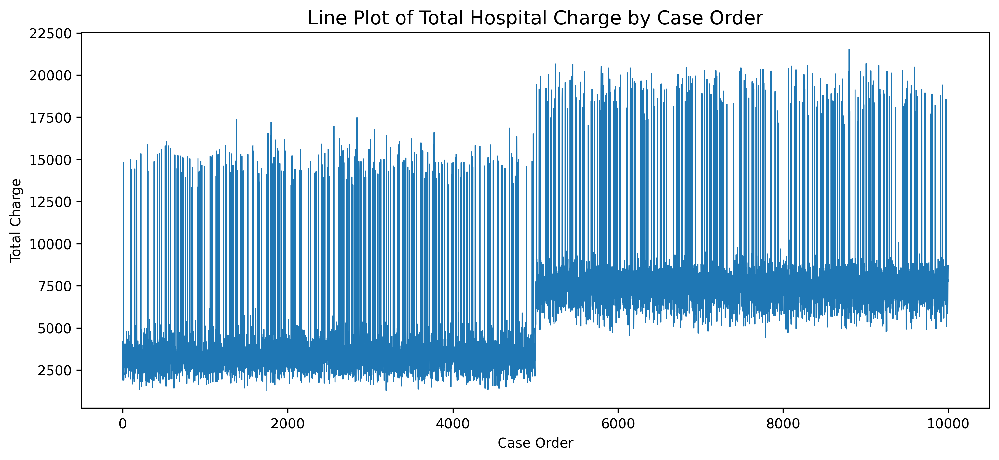
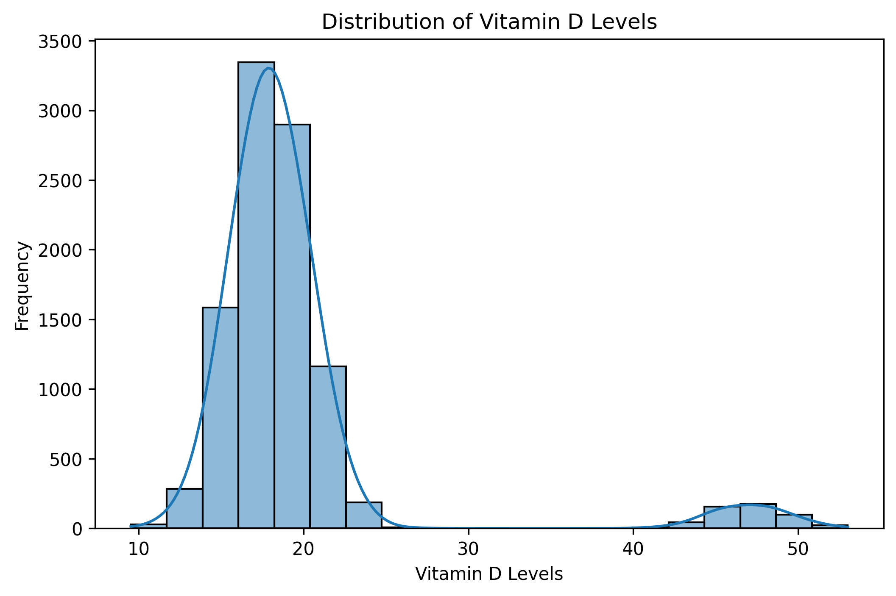
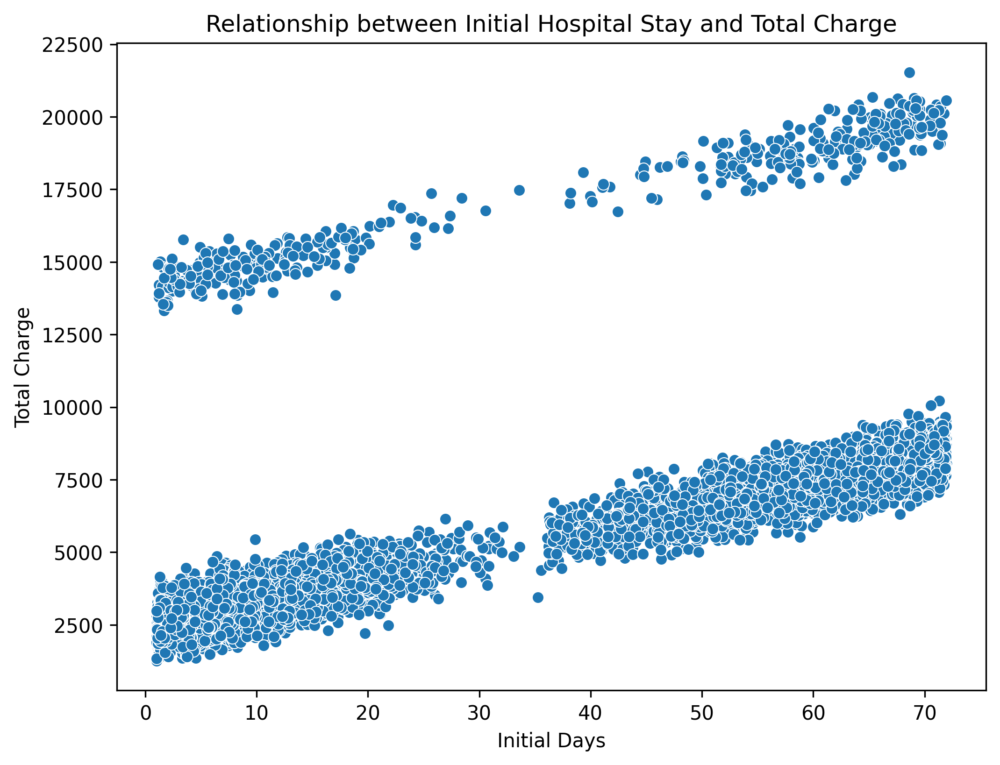

# 🏥 Hospital Readmission Data Analysis using Python

## 📖 Project Overview

This project is the **Part 1** of my Capstone Project, focusing on **Data Acquisition, Data Cleaning, and Exploratory Data Analysis (EDA)** using Python.

The objective is to transform a raw healthcare dataset into a clean and analysis-ready dataset by identifying missing values, handling data inconsistencies, correcting data types, detecting outliers, and performing statistical and visual analysis.

A comprehensive exploratory analysis was conducted to understand the characteristics of the dataset before applying machine learning models in the subsequent phases of the project.

---

# 🎯 Objectives

The main objectives of this project are:

- Load the raw healthcare dataset into Python.
- Inspect the dataset structure and data types.
- Analyze missing values and their percentages.
- Handle missing values using an appropriate imputation strategy.
- Detect and remove duplicate records.
- Correct incorrect data types.
- Optimize memory usage.
- Perform descriptive statistical analysis.
- Analyze skewness of numerical variables.
- Detect outliers using the Interquartile Range (IQR) method.
- Perform Exploratory Data Analysis (EDA).
- Visualize data using different chart types.
- Analyze relationships between variables using Pearson and Spearman correlation.
- Save the cleaned dataset for further machine learning analysis.

---

# 📂 Dataset Description

The project uses a **Medical Hospital Dataset** containing patient demographic information, medical conditions, admission details, hospital services, treatment costs, and patient satisfaction scores.

The dataset contains **10,000 patient records** with **53 attributes**, including both numerical and categorical variables.

### Dataset Summary

| Property | Value |
|----------|-------|
| Dataset Type | Healthcare |
| Records | 10,000 |
| Features | 53 |
| Numerical Columns | 26 |
| Categorical Columns | 27 |
| Missing Values | Present |
| Duplicate Records | None |

---

# 🛠️ Technologies Used

- Python
- Pandas
- NumPy
- Matplotlib
- Seaborn
- Jupyter Notebook

---

# 📥 Data Acquisition

The dataset was imported using the Pandas library.

```python
import pandas as pd

df = pd.read_csv("medical_clean.csv")
```

The following inspections were performed:

- Displayed first five rows
- Displayed dataset shape
- Displayed column names
- Displayed data types
- Generated descriptive statistics

---

# 🧹 Data Cleaning

## Missing Value Analysis

Missing values were identified using:

```python
df.isnull().sum()
```

The percentage of missing values for each column was calculated using:

```python
(df.isnull().sum()/len(df))*100
```

Columns with more than **20% missing values** were identified for further analysis.

For numerical columns with less than 20% missing values, missing values were replaced using the **median**.

### Why Median?

Median was selected because several numerical variables exhibited positive skewness and contained outliers. Unlike the mean, the median is resistant to extreme values and provides a better estimate of the center of skewed distributions.

---

## Duplicate Analysis

Duplicate records were checked using:

```python
df.duplicated().sum()
```

### Result

No duplicate records were found in the dataset.

Therefore, no rows were removed.

---

## Data Type Correction

Several repetitive text columns were converted from **object** to **category** data type to improve memory efficiency.

Examples include:

- Area
- Education
- Employment
- Marital
- Gender
- Services
- HighBlood
- Stroke
- Diabetes
- Arthritis
- Asthma

Memory usage was measured before and after conversion using:

```python
df.memory_usage(deep=True)
```

Memory consumption decreased after converting repetitive string columns into categorical variables.

---

# 📊 Exploratory Data Analysis

## Descriptive Statistics

Descriptive statistics were generated using:

```python
df.describe()
```

Statistics included:

- Mean
- Median
- Standard Deviation
- Minimum
- Maximum
- Quartiles

These statistics provided an overview of the numerical features.

---

## Skewness Analysis

Skewness was calculated for every numerical variable.

The two highest positively skewed variables were:

| Column | Skewness |
|---------|----------|
| VitD_levels | 3.45 |
| Population | 2.23 |

Positive skewness indicates that the data contains a long right tail caused by a small number of unusually high values.

Since positively skewed distributions are influenced by extreme observations, the median was selected for missing value imputation.

---

## Outlier Detection

Outliers were detected using the **Interquartile Range (IQR)** method.

The following variables were analyzed:

### VitD_levels

- Q1 calculated
- Q3 calculated
- IQR calculated
- Lower bound calculated
- Upper bound calculated
- Outliers detected: **534**

### Population

- Q1 calculated
- Q3 calculated
- IQR calculated
- Lower bound calculated
- Upper bound calculated
- Outliers detected: **855**

The outliers were **not removed** because they may represent genuine patient information rather than data entry errors. They will be considered during the modeling stage if necessary.

---

# 📈 Data Visualizations

## 1. Line Plot

A line plot was created using **CaseOrder** and **TotalCharge**.

### Interpretation

The plot shows fluctuations in hospital charges across patient records. Since the dataset is not time-series data, no increasing or decreasing trend is expected.
## Line Plot



---

## 2. Bar Chart

A bar chart compared the average **TotalCharge** for each medical service.

### Interpretation

CT Scan showed the highest average hospital charge, while Intravenous services had the lowest average charge. The differences suggest that service type influences treatment cost.

---

## 3. Histogram

A histogram was created for **VitD_levels**, the most positively skewed variable.

### Interpretation

The histogram displays a long right tail, confirming positive skewness. Most patients have moderate Vitamin D levels, while a few patients have exceptionally high values.

---

## 4. Scatter Plot

A scatter plot was created between:

- Initial_days
- TotalCharge

### Interpretation

A strong positive relationship exists between hospital stay duration and total hospital charge. Patients with longer hospital stays generally incur higher treatment costs.


---

## 5. Box Plot

A box plot compared **TotalCharge** by **ReAdmis** status.

### Interpretation

Patients who were readmitted generally had higher median hospital charges than patients who were not readmitted. Both groups contained several outliers representing exceptionally expensive treatments.

---

# 🔥 Pearson Correlation Analysis

A Pearson correlation matrix was computed and visualized using a heatmap.

### Highest Correlated Pair

| Variables | Correlation |
|------------|-------------|
| Zip ↔ Lng | **0.9007 (absolute value)** |

### Interpretation

Although Zip Code and Longitude are highly correlated, this relationship does **not** imply causation.

Both variables describe the geographical location of patients. Their strong correlation is explained by geography rather than one variable influencing the other.

---

# 📊 Imputation Strategy Comparison

Mean and Median were calculated for the two highest skewed variables:

- VitD_levels
- Population

Since both variables exhibited positive skewness, the **median** was selected for imputation because it is less affected by extreme values than the mean.

After imputation, all missing values in these columns were successfully handled.

---

# 📈 Spearman Correlation Analysis

Both Pearson and Spearman correlation matrices were computed.

The largest differences were observed between:

| Variable Pair | Pearson | Spearman |
|--------------|----------|-----------|
| TotalCharge ↔ VitD_levels | 0.7283 | 0.2303 |
| Initial_days ↔ TotalCharge | 0.6424 | 0.8419 |
| Lat ↔ Lng | -0.1123 | 0.0548 |

### Interpretation

The relationship between **Initial_days** and **TotalCharge** is strongly monotonic but not perfectly linear. Therefore, Spearman correlation better captures this relationship.

For variables influenced by outliers or non-linear patterns, Spearman correlation provides more reliable feature selection guidance.

---

# 📊 Group Aggregation

Grouped statistical analysis was performed using:

```python
df.groupby('Services')['TotalCharge'].agg(['mean','std','count'])
```

Mean, standard deviation, and patient count were calculated for each medical service.

This analysis helps compare treatment costs across different healthcare services and evaluate whether service type has predictive value.

---

# 💾 Output

The cleaned dataset was saved as:

```
cleaned_data.csv
```

This dataset will be used in **Part 2** and **Part 3** of the Capstone Project.

---

# 📁 Repository Structure

```
Hospital-Readmission-Analysis/

│── medical_clean.csv
│── cleaned_data.csv
│── Part1_EDA.ipynb
│── README.md
```

---

# ✅ Key Findings

- The dataset contains 10,000 patient records and 53 variables.
- No duplicate records were found.
- Missing values were successfully identified and handled.
- Median imputation was selected because of positively skewed distributions.
- Vitamin D levels showed the highest positive skewness.
- Population contained a large number of outliers.
- Hospital charges increase with longer hospital stays.
- Readmitted patients generally incur higher hospital costs.
- Geographic variables (Zip and Longitude) exhibited the strongest correlation.
- Spearman correlation identified important monotonic relationships not captured by Pearson correlation.

---

# 🎯 Conclusion

This project successfully transformed a raw healthcare dataset into a clean, structured, and analysis-ready dataset. Comprehensive exploratory data analysis provided valuable insights into missing values, outliers, feature distributions, and relationships between variables.

The cleaned dataset generated in this phase will serve as the foundation for predictive modeling, feature engineering, and machine learning tasks in the next stages of the Capstone Project.

---

